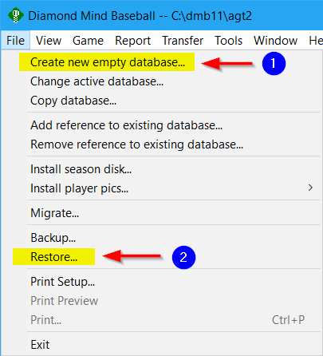

# dmb-homebrew

A collection of homebrew databases for [Diamond Mind Baseball](https://diamond-mind.com) converted to be compatible with the **version 12** game.

The files hosted here serve as a reliable backup resource for the [Homebrew Season Repository](https://www.tapatalk.com/groups/fansofdmb/homebrewed-season-repository-t5397.html) located on the [Fans of Diamond Mind Baseball](https://www.tapatalk.com/groups/fansofdmb/) community forums.  Most of these files can no longer be obtained from their original sources, or their original formats are not compatible with the most recent version of the Diamond Mind Baseball game software.

### Installation Instructions for Homebrew Database Files:

#### 1. Create a new database:

- Open Diamond Mind Baseball
- From the **File** menu select **Create new empty database**. This will create a new, empty database with the name you provide.

#### 2. Restore the homebrew database file to the new database:

- Make sure the new database that you just created is the active database.
- From the **File** menu select **Restore**.
- A dialog box will appear, prompting you to select a backup file to restore from.
- Browse to the location where you saved the homebrew database file and select it.
- Click "Open" to begin the restoration process. This will restore the contents of the homebrew database file to the new database you created.
- Once the restoration is complete, a confirmation message will be displayed.

