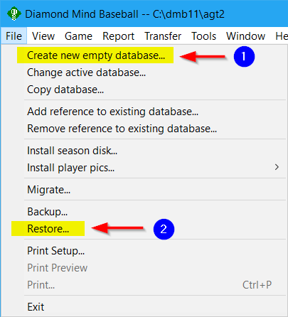

# dmb-homebrew
A collection of homebrew databases for Diamond Mind Baseball converted to be compatible with the most recent version of the game - currently Version 11.

These files are stored here for the sole purpose of providing a reliable backup for the [Homebrew Season Repository](https://www.tapatalk.com/groups/fansofdmb/homebrewed-season-repository-t5397.html) located on the [Fans of Diamond Mind Baseball](https://www.tapatalk.com/groups/fansofdmb/) community forums.  Most of the these files are no longer available from the original source in a format that is compatible with the current version of the Diamond Mind Baseball software (Version 11).  In many cases, the original online source has either been abandoned or is sporadically maintained.

  If you are a creator and would like your work added to or removed from this repsoitory please post a reply in the [homebrew repository](https://www.tapatalk.com/groups/fansofdmb/homebrewed-season-repository-t5397.html) topic on the Fans of Diamond Mind Baseball Forums.

### Installation Instructions:

The standard method of loading one of these homebrew files is to create a new database with the **File -> Create new empty database** command ( 1 ) and then use the **File -> Restore** command ( 2 ) to load the contents of the database backup file to the new database that you created.

 
David Pyke

March 24, 2019
